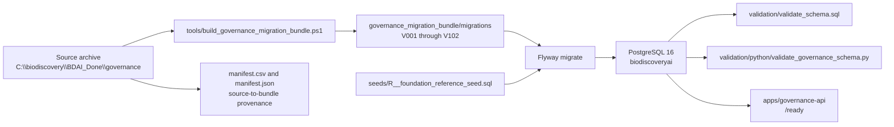

# BioDiscoveryAI Governance Migration Architecture

## Canonical Migration Flow

The deployable database chain is the normalized Flyway bundle under
`governance_migration_bundle/migrations`. The standalone
`sql_hardening_migrations` directory is retained as source/reference material
for the hardening layer and is not a second deployment target.

## Schema Map

| Schema | Role | Representative Objects |
| --- | --- | --- |
| `registry` | Script, environment, and execution registry | `scripts`, `execution_environments`, `script_cli_options` |
| `evidence` | Run evidence and append-only audit records | `execution_runs`, `audit_events`, `execution_steps`, `error_events` |
| `archive` | Durable generated artifacts | `artifacts` |
| `reporting` | Execution reports and compliance views | `execution_reports` |
| `signing` | Evidence snapshots and signatures | `evidence_snapshots` |
| `api_contract` | API-facing contract definitions | API contract metadata |
| `container_governance` | Container image, package, validation, release, incident, and policy governance | `container_images`, `image_builds`, `validation_records`, `release_certifications`, `audit_events` |
| `governance_kernel` | Universal entity, relationship, event, metadata, and temporal model | `governance_entities`, `governance_events`, `entity_relationships`, `temporal_snapshots` |
| `governance_platform` | Shared platform services introduced by later governance layers | Platform service catalogs and runtime metadata |
| `governance_os` | Command, task, and action orchestration | `governance_commands`, `governance_tasks`, `governance_actions` |
| `governance_contracts` | API, CLI, generator, validation, dashboard, and SOP contracts | `api_services`, `cli_tools`, `generators`, `validation_suites`, `dashboard_catalog`, `sop_runbook_catalog` |
| `governance_admin` | Migration, architecture, data dictionary, audit, and operational control metadata | `schema_migrations`, `schema_architecture_map`, `schema_reference_rules` |

## Validation Gates

1. Static lint: `tools/lint_governance_migration_bundle.ps1`
   verifies consecutive migration versions, filename format, manifest/file
   agreement, and seed presence.
2. Full runtime validation: `tools/validate_governance_migration_bundle.ps1`
   starts PostgreSQL, runs Flyway, executes SQL smoke checks, runs the Python
   schema validator, starts the governance API, checks `/ready`, and tears the
   stack down.
3. Regression validation:
   `tools/test_governance_migration_regression.ps1` rebuilds a temporary bundle
   from the source archive, lints it, verifies generated SQL/seed/manifest
   parity with the committed bundle, then runs the full runtime validation
   against that rebuilt bundle.
